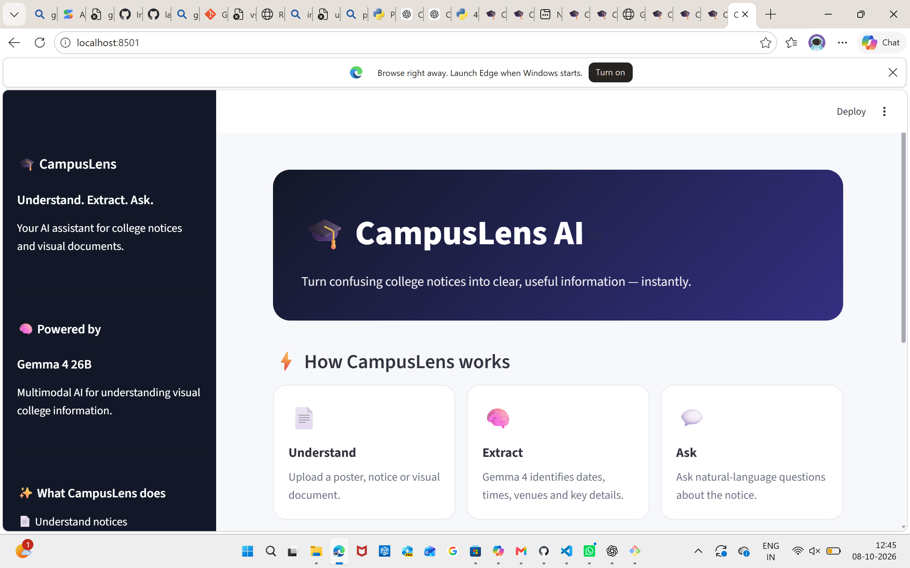

# \# 🎓 CampusLens AI

# 

# > A multimodal AI assistant that uses \*\*Gemma 4\*\* to understand college notices and documents, extract important information, and answer student questions.

# 

# \## 🚀 Overview

# 

# College students receive important information through notices, posters, assignment sheets, event announcements, and other visual documents.

# 

# Finding one specific detail — such as a date, venue, deadline, or requirement — can be time-consuming.

# 

# \*\*CampusLens AI\*\* solves this by allowing students to upload a document and interact with it using natural language.

# 

# Instead of manually searching through a notice, students can simply ask:

# 

# > "Where is the movie screening?"

# 

# CampusLens analyzes the document with \*\*Gemma 4\*\* and provides a direct answer.

# 

# \---

# 

# \## ✨ Features

# 

# \- 📄 Upload college notices and posters

# \- 🧠 Multimodal document understanding with \*\*Gemma 4\*\*

# \- 📋 Automatically extract:

# &#x20; - Event

# &#x20; - Date

# &#x20; - Time

# &#x20; - Venue

# &#x20; - Deadline

# &#x20; - Requirements

# &#x20; - Important details

# \- 💬 Ask natural-language questions about the document

# \- ⚡ Get concise answers based only on the uploaded notice

# \- 🎨 Simple and student-friendly interface

# 

# \---

# 

# \## 🧠 Why Gemma 4?

# 

# Gemma 4 is the core intelligence behind CampusLens.

# 

# CampusLens uses Gemma 4's multimodal capabilities to understand information directly from visual documents rather than relying only on manually extracted text.

# 

# \### CampusLens workflow

# 

# ```text

# &#x20;       📄 College Notice

# &#x20;              │

# &#x20;              ▼

# &#x20;      ┌─────────────────┐

# &#x20;      │    Gemma 4      │

# &#x20;      │ Multimodal AI   │

# &#x20;      └─────────────────┘

# &#x20;              │

# &#x20;              ▼

# &#x20;     📋 Structured Info

# &#x20;              │

# &#x20;              ▼

# &#x20;       💬 Student Q\&A
## 📸 Demo


